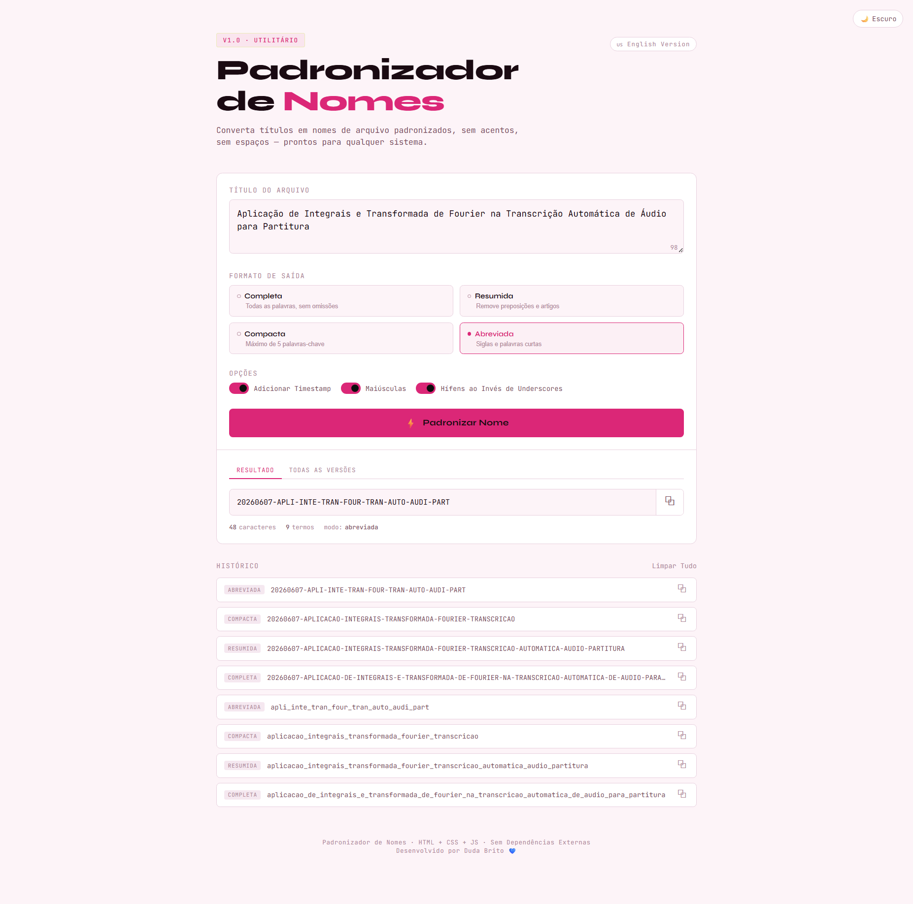

<div align="center">

# 🌸 Padronizador de Nomes de Arquivo

**transforma títulos bagunçados em nomes de arquivo limpos — na hora.**

*sem instalação · sem cadastro · sem frescura · só colar e copiar*

[🇺🇸 read in english](README.en.md) · [abrir o app →](https://maria-brito15.github.io/file-name-standardizer/index.html)

</div>

---

## ✨ por que isso existe

sabe aquele momento em que você tem um título perfeitamente bom como:

> *"Aplicação de Integrais e Transformada de Fourier na Transcrição Automática de Áudio para Partitura"*

e precisa transformar em algo que o sistema operacional, o terminal e o Git não vão odiar?

fazer na mão é **chato** — remove os acentos, troca os espaços por underscores, coloca tudo em minúsculo, inevitavelmente esquece um `ã`. pedir pra uma LLM toda hora cansa também — abre uma aba nova, digita o pedido, copia o resultado... pra uma coisa que deveria ser *só um botão*.

ferramentas como o **[Convert Case](https://convertcase.net/)** acertam nessa filosofia: cola, escolhe, copia, tchau. sem spinner, sem cadastro, sem enrolação. essa ferramenta faz a mesma coisa, mas construída especificamente para nomear arquivos.

---

## 🚀 como usar

**online** — sem instalar nada, é só abrir o link:

> 🔗 [maria-brito15.github.io/file-name-standardizer/index.html](https://maria-brito15.github.io/file-name-standardizer/index.html)

**localmente** — clone o repositório e abra o arquivo direto no navegador:

```bash
git clone https://github.com/maria-brito15/file-name-standardizer.git
# depois abra o index.html no seu navegador
```

```
colar o título  →  escolher o formato  →  copiar  →  pronto
```

---

## 🗂️ formatos de saída

| formato | o que faz | exemplo |
| --- | --- | --- |
| **completa** | todas as palavras, sem omissões | `aplicacao_de_integrais_e_transformada_de_fourier` |
| **resumida** | remove artigos e preposições | `aplicacao_integrais_transformada_fourier` |
| **compacta** | top 5 palavras-chave | `aplicacao_integrais_transformada_fourier_transcricao` |
| **abreviada** | primeiros 4 chars de cada palavra | `apli_inte_tran_four_tran` |

---

## 🎛️ opções extras

combine à vontade:

- 🗓️ **timestamp** — prefixo com a data de hoje `YYYYMMDD`
- 🔠 **maiúsculas** — grita se quiser
- **-** **hífens** — prefere traço em vez de underscore

exemplo com tudo junto no modo compacta:

```
20250607-aplicacao-integrais-transformada-fourier-transcricao
```

---

## 💅 funcionalidades da interface

- **aba "resultado"** — sua saída, pronta pra copiar em um clique
- **aba "todas as versões"** — os 4 formatos lado a lado, cada um copiável
- **histórico** — últimas 30 conversões no `localStorage` entre sessões
- **restaurar do histórico** — clica em qualquer entrada passada pra recuperar
- **tema escuro / claro** — toggle no canto superior direito, preferência salva

---

## 🏗️ arquitetura do código

JS vanilla, zero dependências, princípios SOLID do começo ao fim:

```
TextNormalizer          remove acentos e caracteres especiais
StopWords               filtra artigos e preposições (português)
ConversionStrategies    as 4 estratégias num objeto aberto/fechado (OCP)
OutputFormatter         cuida do separador, caixa e timestamp
convert()               conecta o pipeline, não tem lógica própria
```

adicionar um novo formato = adicionar uma chave no `ConversionStrategies`. nada mais muda.

---

## 🛠️ tecnologias

```
HTML5  ·  CSS3 com variáveis customizadas  ·  JS ES6+ vanilla
JetBrains Mono + Syne  ·  localStorage  ·  zero build step
```

---

## 📁 estrutura do projeto

```
index.html          ← você está aqui (PT)
index.en.html         versão em inglês
interface.png         screenshot do app
README.md             este arquivo
README.en.md          docs em inglês
```

---

## 🖼️ interface



---

<div align="center">

feito com 💙 · roda em qualquer navegador · sem internet após o primeiro carregamento

</div>
